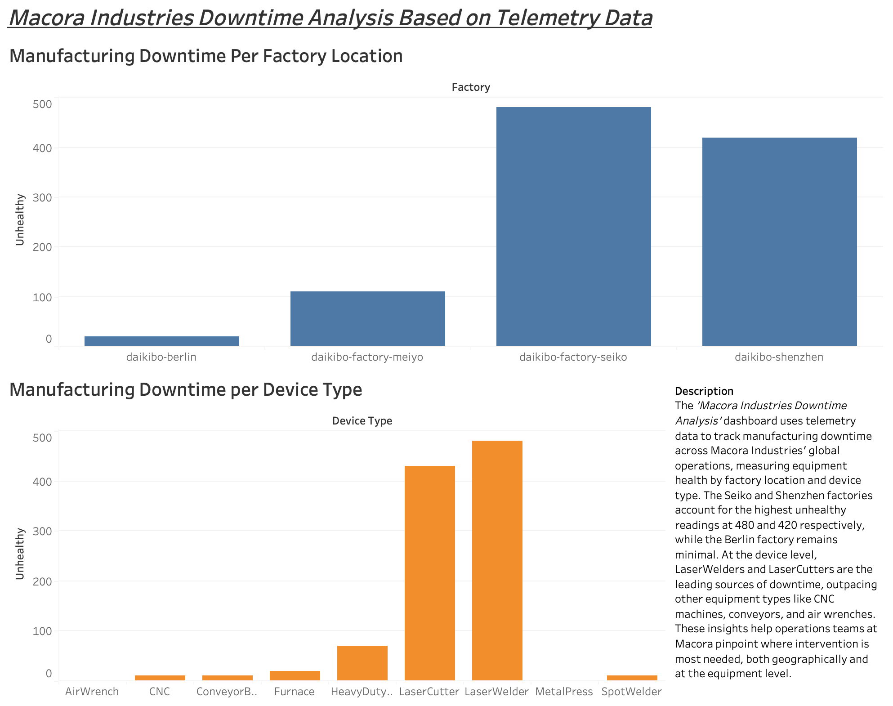
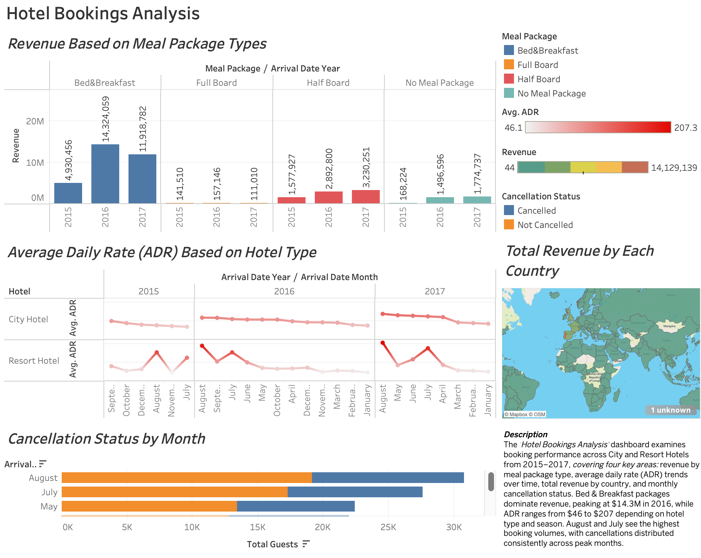

# Joel's Portfolio

# [Project 1: Manufacturing Downtime Analysis](https://github.com/joellacap/manufacturing-downtime-analysis)

This is a project I did for Deloitte's professional development program through [Forage](https://www.theforage.com/simulations/deloitte-au/data-analytics-s5zy), where I created a dashboard in Tableau and cleaned up raw data in Excel.

* The Tableau dashboard data is Macora Industries telemetry data, allowing the firm to report manufacturing downtime based on location and device type.
* The dashboard uses content-filtering techniques to display healthiness of locations and manufacturing device types.
* Displays actionable insight based on visual findings.

## Downtime Analysis Dashboard 

# [Project 2: Hotel Performance Analysis](https://github.com/joellacap/hotel-performance-analysis)

This is a project I did as an undergraduate at Rutgers University for my Management Information Systems course, where I cleaned up raw data, created pivot tables, and graphs in Excel as well as developed a dashboard in Tableau that highlights the firm's performance from 2015-2017.

* The data used in the dashboard is hotel bookings data spanning from 2015-17, containing revenue, cancellation status, ADR (Average Daily Rate), hotel/resort location, meal packages, etc. Allowing stakeholders to properly analyze trends, patterns, and make insight based on a multitude of factors.
* Uses content-filtering techniques to display revenue trends across four meal-packages.
* Tracks ADR over time, segmented by City and Resort hotel types, highlighting seasonal pricing.
* Displays actionable insight based on visual findings across geography, hotel type, and guest behavior.
* EXCEL DATA/DOC CANNOT BE DISPLAYED DUE TO SIZE (can provide if needed)

## Hotel Bookings Dashboard

## Hotel Bookings Pivot Tables and Graps in Excel

This is a presenation I did as an undergraduate at Rutgers University for my Business Decision Analysis Under Uncertainty course, where I created a scenario of a gym company figuring out where to open their first location. They must use decision analysis frameworks to evaluate which market to establish their location under three different economies: Booming, Stable, and Declining.  

* Constructed a payoff matrix, mapping the firm's estimated annual profit for each location across varying economies
* Executed maximax, maximin, and minimax regret decision rules against payoff matrix
* Calculated a regret table to measure opportunity cost per location
* Concluded that no single location is universally optimal, the recommended alternative is a direct function of the decision maker's risk profile, illustrating the core trade-off between expected gain and downside exposure.

